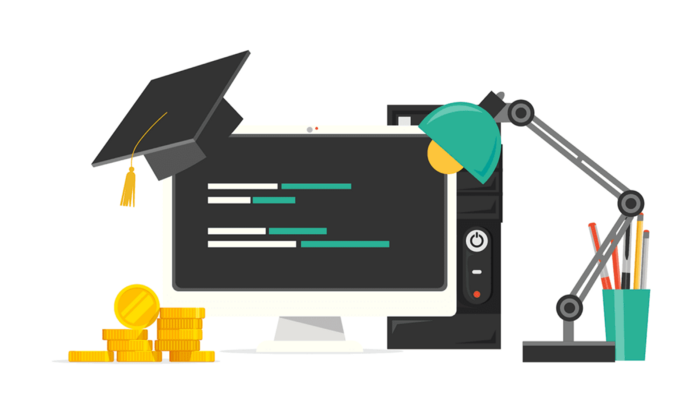
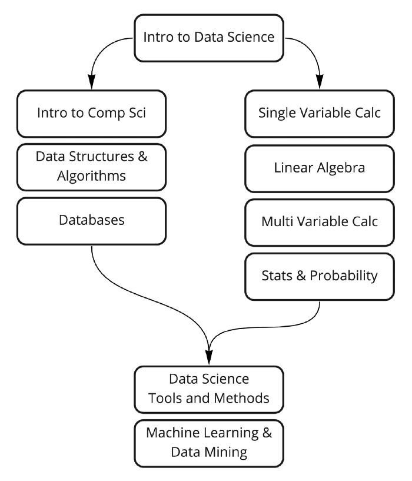

# Learn Data Science : Even when you are broke

Since the [Harvard Bussiness Review](https://hbr.org/2012/10/data-scientist-the-sexiest-job-of-the-21st-century) quoted “*Data Scientist: The Sexiest Job of the 21st Century*”, the rose in demand for data scientist and machine learning expert is unimaginable.

## Why & What is Data Science ?
If you will look around, the majority of the companies are running around for data. Some are looking for the user’s personal data whereas some are looking for professional details of the user. For the last decade, every company needs data in order to sell their products. Data comes in handy in several industrial processes. Products are being developed after proper data analysis of different users.

**Data Science** is one of the most in-demand skills in the current technology world and all kinds of companies are looking for accomplished Data Scientists to make sense of the massive data they are collecting every day to increase sales, profit, and overall business process.

Nowadays many institutes and e-learning platforms are bringing up top notch Master’s/Professional degree programs with a cost worth of $6,000. Since completing my bachelor’s that too; a specialization in mechanical engineering, the broke mind didn’t compel me. So, I gone the other way around, that is too Self Learn.

> More over my instincts, the best way to learn is to experience & understand what you learn by practice.

If you are looking for a career in this field, you need to learn the basics of data analysis and if you need resources you have come to the right place.

Here, I will be sharing my `learning path and material` which helped me to land in my **first job**, that too as a *Research Analyst*. All these courses are **free** and the **best** in their class. Besides this, all these courses are trusted by *hundreds of students* and have *high ratings*.

## 📊 Path to a free self-taught education in Data Science!

As you had seen from the above image, to learn data science; knowing about the theory behind the process, the technical needed to drive the process and the method to curate the insights.

Generally a wish bone knowledge in Both `Math-Statistics` & `Programming` can help you fasten the seat belt to **data science**. Luckily, I had to go through both. lol 🤣

### 1. Introduction to Data science
This will be a introductory level course you need to know about skills that will help you filter out the most important data from a pile of unwanted data. This course will help you develop these skills, besides this, you will learn about data science and its history.

Course Link 👉 [Click Here](https://www.coursera.org/specializations/introduction-data-science)

### 2. Math & Statistics
Math and Statistics for Data Science are essential because these disciples form the basic foundation of all the Machine Learning Algorithms. In fact, Mathematics is behind everything around us, from shapes, patterns, count and colors.

I will suggest these two courses;

**Calculus 101 | Khan Academy** 👉 [Click Here](https://www.khanacademy.org/math/calculus-1)

**Single Variable Calculus | MIT Opensources** 👉 [Click Here](https://ocw.mit.edu/courses/mathematics/18-01sc-single-variable-calculus-fall-2010/)

### 2.2 Linear Algebra
Many popular machine learning methods, including XGBOOST, use matrices to store inputs and process data. Matrices alongside vector spaces and linear equations form the mathematical branch known as Linear Algebra. In order to understand how many machine learning methods work it is essential to get a good understanding of this field.

I will suggest these two courses;

**Linear Algebra | Khan Academy** 👉 [Click Here](https://www.khanacademy.org/math/linear-algebra)

**Linear Algebra | MIT Opensources** 👉 [Click Here](https://ocw.mit.edu/courses/mathematics/18-01sc-single-variable-calculus-fall-2010/)

### 2.3 Multivariable Calculus
In data science, while looking out for relations between function and factors, we can observe varying dependencies of the factors. Many data science & machine learning algorithms utilize multivariable calculus to optimize the performance of models.

I suggest these two courses;

**Multivariable Calculus | Khan Academy** 👉 [Click Here](https://www.khanacademy.org/math/multivariable-calculus)

**Multivariable Calculus | MIT Opensources** 👉 [Click Here](https://ocw.mit.edu/courses/mathematics/18-01sc-single-variable-calculus-fall-2010/)

### 2.4 Statistics and Probability
If there is one thing that I can be the most confident about my Mechanical Engineering background, it would be a rigorous and solid Math and Stats Foundations. In the midst of the hype around data-driven decision making, the basics are somehow getting sidelined. The boom in data science requires an increase in executive statistics and maths skills. Some of the fundamental concepts expected from a business analyst are correlation, causation and how to statistically test hypothesis.



I also suggest these two courses;

**Business Statistics and Analysis | Coursera** 👉 [Click Here](https://www.coursera.org/specializations/business-statistics-analysis)

**Statistics and Probability | Khan Academy** 👉 [Click Here](https://ocw.mit.edu/courses/mathematics/18-01sc-single-variable-calculus-fall-2010/)

That will be all for Math, I could recommend with beginning phase. But as you move along, day by day newer techniques will be learned.

### 3. Computer Science Isle
#### 3.1. Computer Science Principles
Program or code runs on a computer and uses CPU,RAM, input/output devices. This goes over all these basic principals of computer science. Data is stored as bits (1s and 0s) in RAM and disk. The course will also go over fundamentals of binary numbers. In this course only follow first 4 sections (1) `Digital Information` (2) `The Internet` (3) `Programming` (4) `Algorithms`. Completing remaining sections is optional and do it if you have time and interest.

These two courses will provide you with the resources, a little googling can make a big return too;

**AP CS Principles | Khan Academy** 👉 [Click Here](https://www.khanacademy.org/computing/ap-computer-science-principles)

**Intro to CS and Programming using Python | Edx** 👉 [Click Here](https://ocw.mit.edu/courses/mathematics/18-01sc-single-variable-calculus-fall-2010/)

### 3.2. Data structures and Algorithms
There is not a single programming interview where they don’t ask about data structures and algorithms (a.k.a DSA). DSA are fundamental building blocks of any program (doesn’t matter which programming language). Follow this playlist to get your data structure and algo concepts clear.



I also prefer, this course to understand the basics;

**Algorithms, Part I | Coursera** 👉 [Click Here](https://www.coursera.org/learn/algorithms-part1)

### 3.3. Databases (SQL)
Doesn’t matter which career track you choose, you need to have good understanding of relational databases and SQL (structured query language). Here are some course links for SQL. Literally, **SQL Master** is one of the best hat you can wear while working in such roles - my experience to say.

I will suggest these three, of different kinds;

**Database Management Essentials | Coursera** 👉 [Click Here](https://www.coursera.org/learn/database-management)

**Intro to SQL | Khan Academy** 👉 [Click Here](https://www.khanacademy.org/computing/computer-programming/sql)

Check this awesome playlist to learn about from installation to basic exercises for SQL Server.



### 4. Data Science Tools and Methods
Data scientists apply some operational methods, which are called the techniques on the data through various software, which are known as tools. This combination is used in acquiring data, refining it for the purpose intended, manipulating and labeling, and then examining the results for the best possible outcomes.

**Tools for Data Science | Coursera** 👉 [Click Here](https://www.coursera.org/learn/open-source-tools-for-data-science)

### Which programming languages should I use?
`Python` and `R` are heavily used in Data Science community. Remember, the important thing for each course is to internalize the core concepts and to be able to use them with whatever tool (programming language) that you wish. I prefer `Python` more, I had seen more people opting it.

**Python For Data Science | Great Learning** 👉 [Click Here](https://www.mygreatlearning.com/academy/learn-for-free/courses/data-science-with-python)




### 5. Machine Learning & Data Mining
Many people do the mistake of learning every algorithm in ML and forget where it actually helps in solving a problem. For beginners, it is suggested that they learn the popular and standard algorithms. A complicated algorithm is not always the solution for complex applications. It is all about how an ML problem is solved optimally.

I will suggest these two;

**ML Crash Course | Google Developers** 👉 [Click Here](https://developers.google.com/machine-learning/crash-course)

**Machine Learning | Coursera** 👉 [Click Here](https://www.coursera.org/learn/machine-learning)

> You can Audit the Courses on **Coursera** and **Edx** for free access to the content. If you wish to obtain a certificate; go for the certified plans.
> Most of the Youtube series choosed are from [Code Basics](https://www.youtube.com/channel/UCh9nVJoWXmFb7sLApWGcLPQ) - because i love the way he represents concepts, ideation for projects & interviews with many data science professional.

### 🚨 Useful Tips
Please watch this video to understand how you can learn effectively so that you can get maximum output by investing minimum amount of time.



#### Following discipline and not giving up
Learning coding, especially when you are new, can get frustrating at times. Every good programmer has gone through this pain so if you are facing issues, don’t start thinking you are not smart and coding is not your thing. You need to have lot of patience. When you come from non coding background, thinking in terms of coding is a big shift in the mind paradigm hence it can take some time before it starts clicking you.

>> If you have any queries regarding any topics, feel free to connect with me. Kindly share among your colleague, it may be helpful for them.

---
The Article was also published on my [Medium](https://medium.com/@sinanthahir/learn-data-science-even-when-you-are-broke-b5561e837f7c) Space.