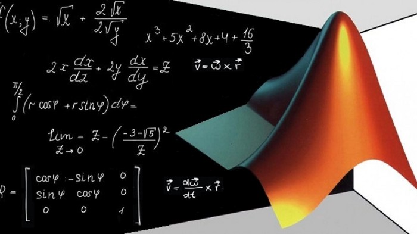

## Matlab Modeling and Simulation : Cheat Sheet & Samples

**Matlab**, is a high-performance language which assimilates computation, visualization and programming in a single environment. The name MATLAB stands for `matrix laboratory`. MATLAB was originally written to provide easy access to matrix software developed by the `LINPACK` and `EISPACK` projects, which together represent the *state-of-the-art* in software for matrix computation.

MATLAB is an *interactive system* whose basic data element is an array that does not require dimensioning. This allows you to solve many technical computing problems, especially those with matrix and vector formulations, in a fraction of the time it would take to write a program in a scalar noninteractive language such as `C` or `Fortran`.

MATLAB® is widely used in different areas of applied mathematics, in education and research and in numerous industries. This software finds its wide applications in different domains of engineering such as:

1. Electronics engineers mainly use MATLAB® for designing more efficient devices that are smaller in size and can integrate wireless communications, audio, video, and other attributes.
2. In electrical engineering, the application of this program is to examine and simulate momentary phenomena in power systems.
3. Mechanical engineers need MATLAB® for scrutiny of problems in control systems, mechanical vibrations, basic engineering mechanics, electrical circuits, statics and dynamics and numerical methods.
4. It is used to model and simulate physical problems in the field of chemical engineering.

## Cheat Sheet
Small variables like x and y will be either row or column vectors and A will always be a matrix.

### Basic Commands

| Command      | Function |
| ----------- | ----------- |
| `clc`| Clear command window|
| `clear (all)`| Clear all variables|
|`close all`|Close all plots|
| `clf`| Clear all plots|
| `doc command` | Extensive help page for command|
|`help command`|Quick help page for command|
| `%This is a command`| Indicates a comment|
| `a=5;`   | Semicolon suppress ouput|
|`whos`|List all variables defined|
| `disp('text')`| Print text|
| `save 'file.mat'`   | Save variables to file.mat|
|`load 'file.mat'`|Load variables from file.mat|
|`diary on`|Record input/output to file diary|

### Keyboard Shortcuts

| Shortcuts     | Function |
| ----------- | ----------- |
| `F1`| Clear command window|
| `F5`| Clear all variables|
|`F9`|Close all plots|
| `F10`| Clear all plots|
| `F11` | Extensive help page for command|
|`F12`|Quick help page for command|
| `Ctrl+D`| Indicates a comment|
| `Ctrl+R`   | Semicolon suppress ouput|
|`Ctrl+T`|List all variables defined|
| `Ctrl+N`| Open new script|
| `Ctrl+W`   | Close script|
|`Ctrl+C`|Abort operation|