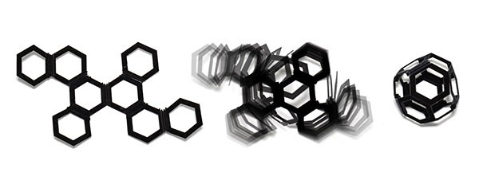
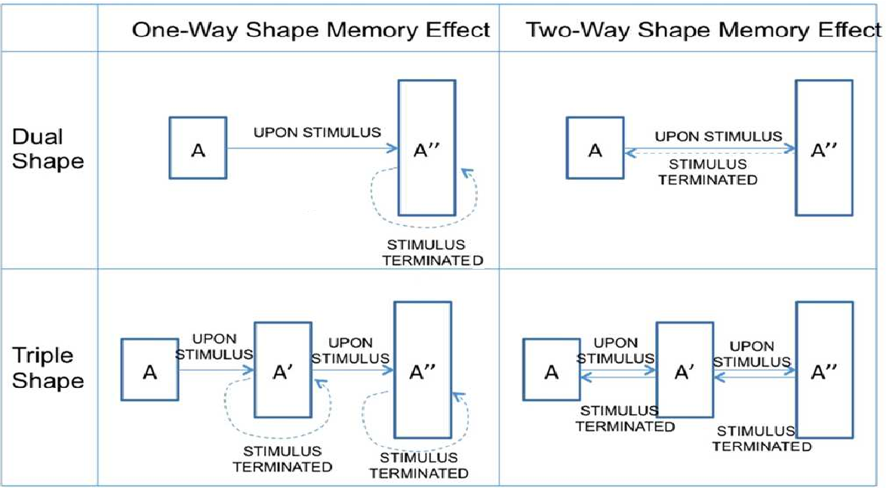
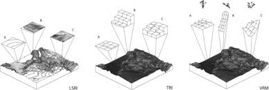
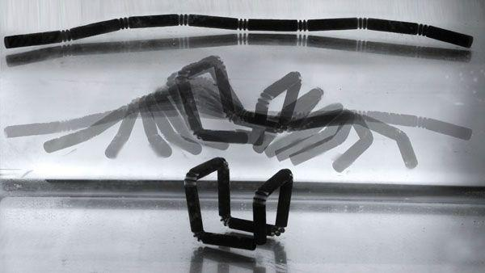
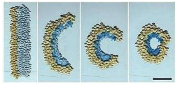
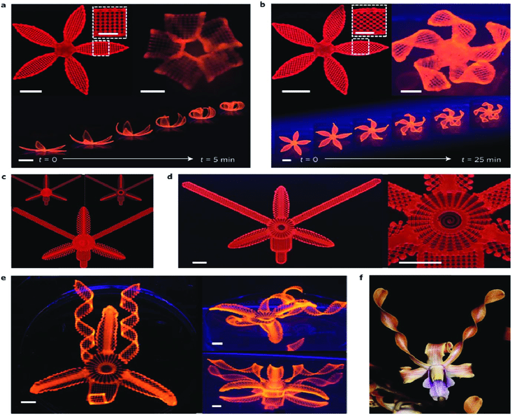
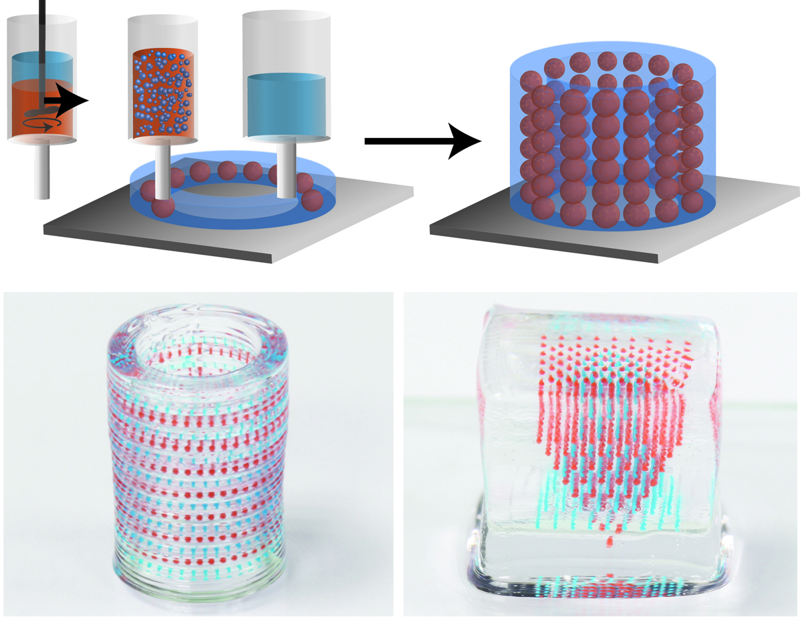
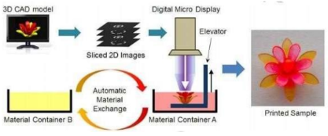

We know how the field of manufacturing was revolutionized by the innovation of 3D printing. Though it was invented in 1980s it has popularized recently and has been applied to various field, ranging from biomedical science to space science.

**4D printing** is a recently developed field originating from 3D printing, shows promising capabilities and broad potential applications. 4D printing was initiated and termed by research group at MIT lead by 'Tibbits'(2013). It relies on the fast growth of smart materials, 3D printers, and mathematical modeling and design. 4D printing shows advantages over 3D printing in several aspects. Its application is beyond we can ever think. Its now in its embryonic stage as 3D printing it will take few decades to come into its full potential. Multi-disciplinary researches will aid in its growth.

## 4D PRINTING
It was initially defined as 4D printing = 3D printing + time, where the shape, property, or functionality of a 3D printed structure can change as a function of time. A much more comprehensive definition is, 4D printing is a targeted evolution of the 3D printed structure, in terms of shape, property, and functionality. It is capable of achieving self-assembly, multifunctionality, and self-repair. It is time-dependent, printer-independent, and predictable.

### 3D PRINTING FACILITY
Usually, a 4D printed structure is created by combining several materials in the appropriate distribution into a single, one-time printed structure. The differences in material properties, such as swelling ratio and thermal expansion coefficient, will lead to the desired shape shifting behaviour. Therefore, 3D printing is necessary for the fabrication of multi-material structures with simple geometry.

### STIMULUS
Stimulus is required to trigger the alterations of shape/property/functionality of a 4D printed structure. The stimuli that researchers have used in 4D printing thus far include water, heat, a combination of heat and light, and a combination of water and heat. The selection of the stimulus depends on the requirements of the specific application, which also determines the types of smart materials employed in the 4D printed structures.

### STIMULUS RESPONSIVE MATERIAL
Stimulus-responsive material is one of the most critical components of 4D printing. The capability of this group of materials is defined by the following characteristics: self-sensing, decision making, responsiveness, shape memory, self-adaptability, multi-functionality, and self-repair.

## INTERACTION MECHANISM
In some cases, the desired shape of a 4D printed structure is not directly achieved by simply exposing the smart materials to the stimulus. The stimulus needs to be applied in a certain sequence under an appropriate amount of time, which is referred to as the interaction mechanism. For example, one of the main interaction mechanisms is constrained-thermo-mechanics. In this mechanism, the stimulus is heat and the smart material has the shape memory effect. It contains a 4- step cycle. First, the structure is deformed by an external load at a high temperature; second, the temperature is lowered while the external load is maintained; third, the structure is unloaded at the low temperature and the desired shape is achieved; fourth, the original shape can be recovered by reheating the structure.

## Shape Shifting Behaviours
The shape shifting behaviours include folding, bending, twisting, linear or nonlinear expansion/ contraction, surface curling, and the generation of surface topographical features such as wrinkles, creases, and buckles.

### SHAPE CHANGING VS. SHAPE MEMORY MATERIALS
Shape shifting materials can be divided into two shape changing materials and shape memory materials. A shape changing material changes its shape immediately after a stimulus is applied, and returns to its permanent shape immediately after the stimulus is removed. Whereas shape memory material involves two step cycle, upon application of stimuli material is deformed from its primary shape to metastable temporary shape (programming step), followed by the recovery to primary shape on application of suitable stimuli (recovery step).

### DUAL, TRIPLE, AND MULTI SHAPE MEMORY EFFECTS
A stimulus responsive shape memory material has the ability to memorize its permanent shape and on subjecting to stimulus deformation occurs between a permanent and temporary shape. A dual-SME material has one permanent shape and one temporary shape, while a triple-SME material has one permanent shape and two temporary shapes. Similarly, a multi (n)-SME material has one permanent shape and (n −1) temporary shapes.

### FOLDING VS. BENDING
Bending is a global deformation associated with smoother curvatures, while folding is localized deformation that is associated with sharp angles occurring in a narrow hinge area in other words, bending relates to a distributed curvature, whereas folding is more localized.

### SURFACE TOPOGRAPHY
It is the representation of local deviation of a surface from a flat plane. Typical features include wrinkling, creasing, and buckling. These features usually occur under compressive loading conditions.

## SHAPE-SHIFTING TYPES AND DIMENSIONS
### 1D-to-1D Expansion or Contraction
It is also considered to be 4D printed structures since shape shifting occurs overtime. The stimulus is water and the 4D printed structure contains alternating layers of rigid discs and active hydrogels. After the structure is immersed in water, the hydrogel parts will swell while the rigid discs remain the same. By adjusting the ratio of expandable hydrogels to rigid discs, the structure can show linear shape-shifting behaviour with a desirable final length.

### 1D-to-2D Folding
There are two types of materials involved in the structure: rigid and active. The active material is a hydrogel that can swell when immersed in water while the rigid parts remain intact. This difference provides a stress mismatch and enables the overall shape to be changed toward a specific direction. The position and volume of the active and rigid materials in the structure can be designed to achieve different shape-shifting directions.

### 1D-to-3D Folding
The structure contains the same two materials described above. This is an illustration of 1Dto3D shape-shifting by self-folding mechanism. For each wireframe hinge, two rigid discs are embedded in the hydrogel part, which connects the two rigid strands. This is shown in Figure below. These two rigid discs can limit the maximum degree of free shape-shifting.

### 2D-to-2D Bending
2D-to-2D self-bending in a 4D bio-printed networks of droplets. As shown in Fig a rectangular network could be bent into a circle. This shape-shifting behaviour is based on the differences in osmolarity of the droplets. The droplets with higher osmolarity swell and the droplets with lower osmolarity shrink. The shape continues to change until the osmolarity gradient becomes zero.

### 2D-to-3D Bending
A complex structure was created by tearing paper off of the flowerlike 3D structure. Heat is the stimulus in this shape-shifting behaviour. However, their experiment is different from the regular shape memory cycles with programming and recovery steps. In this mechanism, there is no need to apply external force at a high temperature and cool down to a low temperature while maintaining the previously applied force. The shape-shifting behaviour is enabled by different thermal expansion coefficients of the active and non-active materials.

### 3D Folding
2D-to-3D shape-shifting behaviour based on self-folding. This shape-shifting behaviour is enabled by a stress mismatch between rigid and active materials due to their different swelling behaviours under water.

### 2D-to-3D Twisting
Here the fibers printed with certain angles to induce twisting, and by adjusting the print angles of active fibers, the final twist angle would be changed.

### 2D-to-3D Bending and Twisting
This is produced by the biomimetic 4D printing process shown in. This shape shifting behaviour is caused by the differences in the swelling ratios of active and rigid materials under water.

### 3D-to-3D Bending
This shape-shifting behaviour is triggered by dissolution of an appropriate material into a suitable solvent, which will be further discussed in the section discussing shape-shifting mechanisms and stimuli.

3D-to-3D self-bending shape-shifting behaviour in a prosthetic finger made from thermoplastic elastomer (TPE).

## Material Structures
The materials used in 4D printing are mainly classified into smart materials and conventional (nonsmart) material. In additive manufacturing, structures are divided into single-material and multimaterial structures. Further multi-material structures are classified into discrete multiple materials, composite materials, and porous materials. Another set of classification of multi material structure include uniform distribution, gradient distribution, and special patterns. Also, material structures can be classified as a structure with or without joints and hinges.

### MULTI-MATERIAL STRUCTURES
In 4D printing, multiple materials usually need to be inserted into a single and one-time printed structure. This multi-material structure can be a mixture of different smart materials or a combination of smart materials and conventional materials. The single-material structure in 4D printing should always be fabricated with a smart material. In addition, it needs to be based on the structure with a gradient distribution of materials. The gradient distribution of a single material means that the density of the structure is different at various locations. This anisotropy can generate shape-shifting behaviours such as bending and twisting, which is beyond linear expansion and contraction.

### DIGITAL MATERIALS
In nature, biological structures usually consist of fundamental building blocks that can be considered physical voxels, such as DNA and proteins. Physical 3D object is made of many digital units (voxels) arranged selectively in a 3D lattice, as opposed to analog (continuous) material commonly used in conventional. Digital material is defined as an assembly of various physical voxels. The spatial arrangement of voxels plays a major role in determining the features of a 4D-printed structure. In digital materials, each voxel contains only one material. Adjacent voxels can be composed of different materials. Each voxel has its own properties and the collection of different voxels results in the multi-material structure.

### MULTI-MATERIAL ADDITIVE MANUFACTURING SYSTEM
To model the material structure in various length and time scales for digital materials, Myres (1999) developed a software called the Digital Material. Popescu (2006) proposed a new manufacturing process for digital materials that is reversible for disassembly and can reuse the building blocks of the structure. Huang (2016) demonstrated an approach for ultrafast printing of shape-shifting materials. Zhou (2013)reported that there are several limitations to the current 3D additive manufacturing process. For example, printers with inkjet nozzles can only print materials with certain viscosities and curing temperatures. The fused deposition modeling (FDM) process is relatively slow and has limited options for its minimum nozzle size. Zhou investigated several new techniques for digital material production using mask- imageprojection-based stereolithography. Ge (2016) provided an approach for printing multimaterial shape memory polymers (SMPs) with a high resolution (up to a few microns). This approach is enabled by a high-resolution projection microstereolithography (PμSL) additive manufacturing system with an automated material exchange mechanism. In order to enable 4D printing for biomedical applications, multi-material additive manufacturing systems that can print from aqueous mediums needs to be developed (Loh, 2016). In this regard, the direct-write (DW) printing technique (Lewis, Gratson & Lewis, Lebel), which is suitable for printing polymeric solutions, can be engaged.

**4D printing** is the one of emerging technology which has a vast potential for growth. It will revolutionize most of the fields especially manufacturing industry, the stimulus responsive programming of these products will give a new horizon to packing and transportation sectors. The scope of assembling a product at required locations will be a huge step up.

Also, it will provide extensive support in the medical field with better accuracy the manufacturing of customized smart implants, tools and devices. organ printing, tissue engineering and selfassembling human scale biomaterials. It creates a development of biomedical splint, stents, bioprinting and orthodontics devices as per human growth. In the future, this emerging technology will become more beneficial and help to create
endless possibilities in the medical field.

**4D printing** has three main capabilities: self-assembly, multi-functionality, and self-repair; so, its application level is beyond imaginable, but the factors lacking are mainly availability of materials and a large amount of multidisciplinary research needs to be conducted in the future.