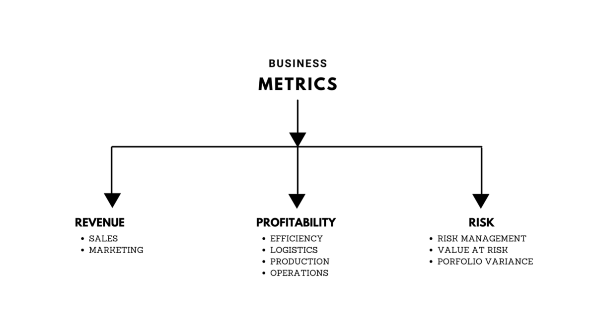

**Be The Unicorn Business Analyst**
## What are Metrics and How to choose one?
#### Understanding and identifying relevant business metrics.

Technology is constantly evolving, but the technology of 2022 is still a mystery to many. There are a few trends that we can expect to see in the end of 2022. Artificial Intelligence, Robotics and other form of Automation will be a major part of the future and will play an important role in how businesses operate and interact with their customers. Advances in technology will continue to occur and will transform the way business is done. In 2022, we can expect to see intelligence being embedded into everyday objects, interactive displays showing more real-time data than ever before.


So, who can drive insights from these real time data to enhance there business ?


### A Business Analyst
A **Business Analyst** is a person who helps businesses to analyze their processes, products, services, and systems to improve current processes and make profitable decisions through insights and data analysis. A Business analyst also helps organizations to document business processes by assessing the business model and its integration with technology.

Some people think that the role of Business Analyst is to make money for the organization, which may not be true in direct context. But indirectly, the action and decision taken by Business Analysts do leave an impact on the financial prospects of the organization.

The well-known expression, "**if you can't measure it, you can't improve it**" is anything but trifling. A change in business process managed can only become great and valuable if quality and performance are effectively measured. **How do a Business Analyst measure process's performance? How do a Business Analyst map a process's performance to business success?**


After you've read this article, you will be able to find the treasure in that ocean to identify and utilize the business metrics that allow data driven companies to thrive.


## Business Metrices
A **Business Metric** is a quantifiable measure businesses use to track, monitor and assess the success or failure of various [business processes](https://kissflow.com/workflow/bpm/business-process/), or we can say that; **Business Metrics** are used to drive improvements and help businesses focus their people and resources on what's important.

Both of them are true, for the least we can tell that; **Business Metrices** are numbers that can impact when we change our business process. The main goal of measuring business metrics is to track cost management, but the overall point of employing them is to communicate a company's progression toward certain long- and short-term objectives.

> **For example**; *you are running a retail clothing store rooted in the state of Dallas, Texas. Where we have a 8.25% sales tax, the sales tax is not a metric. There's nothing that we can do to change it. On the Other hand, you are running a online shopping site with it; the percentage of people who viewed your ad on a particular website. Then used it as call to action to your homepage. Can change every time the ad contents change. Or when the time of day changes, where we run the ad, on what websites it appears etc. The people who viewed your ads, visited your website through these ads…, all these are quantitative and can drive insights on your process.*

Overall, metrics should reflect and support the various strategies for all aspects of the organization, like marketing, customer acquisition, service offerings, etc. Metrics indicate the priorities of the company and provide a window on performance, ethos and ambition.

### The world appears to be flooded with an ocean of data, but much of it not so useful.

The same goes with the business metric's too, flooded with a lot data. To define a metric is similar to that of finding a jewel in the deep ocean  - if you have to spend too much time finding it then you'll sink. Employees need to understand the metrics, how they can influence it and what is expected of them. Like Metrics, there are [Key Performance Indicators](https://www.klipfolio.com/resources/articles/what-is-a-key-performance-indicator) (KPIs); a measurable quantitative. Lets keep KPIs for another day.

To make the most use of business metrices, To be the unicorn business analyst, you must be familiar and able to know, what and when we business metrics are used. So here, I'm going to get you know about some of them with suitable scenario cases. Business Metrics can be broadly classified into - **Revenue**, **Profitability** and **Risk**.

### Revenue Metrics
These metrics are outward facing and always refer to sales and marketing - means directly to your revenue. They tells us about how well or badly the company is marketing the products and sales are done.

> **For Example** : *If the Company's VP of the salesforce, wants to know how well many units of each commodity is sold over a given time interval or how it is compared to last year. If they want to know about sales funnel(Potential future customers identified) or something like where they are in the step by step process of moving towards making a purchase. sometime it will be like the Marketing team wants to know how well effective are there marketing campaign as such of Ads, Mail, Letters, CMA and Response are like.*

#### Everything that relates directly or indirectly to selling is a Revenue meterics.

### Profitability Metrics

Always to do with the efficiency of the process by which the company creates and delievers its products and services to customers. These are Operational meterics by companies productions also relates to typically; how much cash as un-sold inventory. Somewhat of
- How much production is unsaleable due to spoilage/wastage.
- How often, it is unable to meet urgent customers requests and loses sales because of in-sufficient production or inventory.
- What portion of products of a production line are rejected as defective.
- How much spent on variable costs, raw amd labour, per unit product...


Note: Even a company with large and rapidly increasing revenue will fail to be profitable it cannot deliever its offering efficiently.


Large established companies with relatively little room to increase revenues can often achieve significant increase in profitability by focusing on improving operational efficiencies.

### Risk Metrics

Mostly to do with tracking down where possibly reducing the many potential dangers a company faces.

> **For example**: *If a company spending large portion of net cash flow every month on interest and its debt; then a small drop in revenue by external shock like a recession can lead to a insoluent or collapse*

- Secondary creditors have the right to seize a company's assets. If they're not paid on time.
- Net cash put is always the most important metrics to track.


Tobe like; How many months caompany can survive at present burn rate?


> **Another example**: *Churn, a company with a subscription based revenue model that has a very high churn rate, the rate at which subscribers drop off within a year, runs risk over time.*

The greater the reliance on term recurring revenue customers, the less dependent on constantly converting to new clients.

> **Other example**: *Finance, Bank that issue credit cards are in the bussiness of tracking how much exposure they have to a potential customers defaults at any time and what percentage of customers defaults at 6 months or new.*

Money managers use **Volatility of returns** and **Maximum historical drawn down from high watermark**, as a proxy for their portfolio's risk exposure.

#### A great company will harness all three types of temperments and track all three types of metrices.

## Dynamic Business Metrices

Dynamic Metrices are defined and can be communicated in a manner that conveys urgency. That address the right question, what change in process can we make to increase revenue maximize profitabilty or reduce risk?

Two attributes that make a business metrics dynamics:
- Will the metric change significantly over intervals of a month or less?
- Whether the actions company takes can visible or significantly impact in the short term?

> **Case 1**: *The monthly rent a stand alone retail store in mall pays on in three year lease is a business metrices relates*