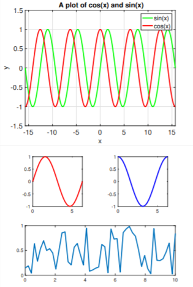

## Matlab Modeling and Simulation : Cheat Sheet & Samples


**Matlab**, is a high-performance language which assimilates computation, visualization and programming in a single environment. The name MATLAB stands for `matrix laboratory`. MATLAB was originally written to provide easy access to matrix software developed by the `LINPACK` and `EISPACK` projects, which together represent the *state-of-the-art* in software for matrix computation.

MATLAB is an *interactive system* whose basic data element is an array that does not require dimensioning. This allows you to solve many technical computing problems, especially those with matrix and vector formulations, in a fraction of the time it would take to write a program in a scalar noninteractive language such as `C` or `Fortran`.

MATLAB® is widely used in different areas of applied mathematics, in education and research and in numerous industries. This software finds its wide applications in different domains of engineering such as:

1. Electronics engineers mainly use MATLAB® for designing more efficient devices that are smaller in size and can integrate wireless communications, audio, video, and other attributes.
2. In electrical engineering, the application of this program is to examine and simulate momentary phenomena in power systems.
3. Mechanical engineers need MATLAB® for scrutiny of problems in control systems, mechanical vibrations, basic engineering mechanics, electrical circuits, statics and dynamics and numerical methods.
4. It is used to model and simulate physical problems in the field of chemical engineering.

## Cheat Sheet
Small variables like x and y will be either row or column vectors and A will always be a matrix.

### Basic Commands

| Command      | Function |
| ----------- | ----------- |
| `clc`| Clear command window|
| `clear (all)`| Clear all variables|
|`close all`|Close all plots|
| `clf`| Clear all plots|
| `doc command` | Extensive help page for command|
|`help command`|Quick help page for command|
| `%This is a command`| Indicates a comment|
| `a=5;`   | Semicolon suppress ouput|
|`whos`|List all variables defined|
| `disp('text')`| Print text|
| `save 'file.mat'`   | Save variables to file.mat|
|`load 'file.mat'`|Load variables from file.mat|
|`diary on`|Record input/output to file diary|

### Keyboard Shortcuts

| Shortcuts     | Function |
| ----------- | ----------- |
| `F1`| Help/documentation for highlighted function|
| `F5`| Run Code|
|`F9`|Run highlighted code|
| `F10`|Run code line|
| `F11` | Run code line, enter functions|
|`F12`|Insert break point|
| `Ctrl+D`|Open Highlighted codes file|
| `Ctrl+R`   |Comment code|
|`Ctrl+T`|Uncomment code|
| `Ctrl+N`| Open new script|
| `Ctrl+W`   | Close script|
|`Ctrl+C`|Abort operation|

### Entries of Matrices and Vectors

| Entries    | Function |
| ----------- | ----------- |
| `abs(x)`|The absolute value of *x*|
| `eps`|Floating point accuracy|
|`1e6`|10^6|
| `sum(x)`|Sums elements in *x*|
| `round` |Rounds to the nearest integer|
|`ceil`|Rounds to the nearest integer greater than or equal to that element|
| `fix`|Rounds to the nearest integer toward zero|
| `floor`   |Rounds to the nearest integer less than or equal to that element|

### Cell Manipulation

| Manipulation    | Function |
| ----------- | ----------- |
| `x = cell(a, b)`|a * b cell array|
| `x{n,m}`|Access cell element n,m|
|`cell2mat(x)`|Transforms cell to matrix|

### Manipulation of Variables

| Manipulation    | Function |
| ----------- | ----------- |
| `a=500`|Define variables *a* to be 500|
| `x=[3,1,4]`|Set *x* to be the row vector [3,1,4]|
|`x=[3;1;4]`|Set *x* to be the column vector [3,1,4]^*T*|
| `x(2)=7`|Change *x* from [3,1,4] to [3,7,4]|
| `A(2,1)=0`|Change A`2,1 from 5 to 0|

### Basic Arithmetic and Functions

| Operations | Function |
| ----------- | ----------- |
| `1*2`,`3+4`,`5-6`,`7/8`|Multiply, add, subtract and divide|
| `2^8`|compute 2^8|
|`sqrt(16)`|compute square root of 16|
| `log(5)`|compute ln(5)|
| `sin(2*pi/6)`|Compute sin(60)|

### Operations on Matrices and Vectors
| Operations    | Function |
| ----------- | ----------- |
| `x + 5`|Add 5 to every element of *x*|
| `x + y`|Elementwise addition of two vectors *x* and *y*|
|`10 * y`|Multiply every element of *y* by 10|
|`A * y`|Product of a matrix and vector|
|`A * B`|Product of two matrices|
|`A .* B`|Element-wise product of two matrices|
|`A ^ 4`|Square matrix **A** to the fourth power|
|`A .^ 4`|Every element of **A** to the fourth power|
|`cos(A)`|Compute the cosine of every element of **A**|
|`abs(A)`|Compute the absolute values of every element of **A**|
|`A'`|Transpose of **A**|
|`det(A)`|Compute the determinant of **A**|
|`size(A)`|Get the size of **A**|

### Data Import & Export
| Command    | Function |
| ----------- | ----------- |
| `xlsread`/`xlswrite`|Spreadsheets (*.xls,.xlsm*)|
| `load/save -ascii`|Text files (*.txt,.csv*)|
|`load/save`|Matlab files (*.m*)|
|`imread/imwrite`|Image files|

### Solving linear equations
| Command    | Function |
| ----------- | ----------- |
| `inv(A)`|Compute the inverse **A^-1**|
| `eig(A)`|Compute the eigenvalue of ***A***|
|`[L,U,P] = lu(A)`|The LU factorization ***PA = LU***|
|`[V,D] = eig(A)`|***V*** are the eigenvectors of A, and the diagonals ***diag(D)*** are the eigenvalues of A|
| `A\b`|Compute the solution *x* to **A*x*=b**|

### Plotting
| Command    | Function |
| ----------- | ----------- |
| `plot(x,y)`|Plot *y* versus *x*|
| `loglog(x,y)`|Plot *y* versus *x* on a log-log scale|
|`semilogx(x,y)`|Plot *y* versus *x* with *x* on a log scale|
| `axis equal`|Force the *y* and *x* axes to be scaled equally|
| `title('A Title')`|Add a title to the plot|
| `xlabel('x text')`|Add a label to the *x* axis|
| `legend('foo', 'bar')`|Label two curves for the plot|
| `grif on/off`|Add a grid to the plot|
| `subplot(a,b,c)`|For multiple figures in one plot|
| `hold on`|Retains current figure when adding new stuff|
| `set(fig1, 'LineWidth', 2)`|Change line width|
| `set(fig1, 'LineStyle', '-')`|Change to dot marker|
| `set(fig1, 'Marker', '.')`|Change marker type|

### Debugging
| Command    | Function |
| ----------- | ----------- |
| `tic/toc`|Start/Stop Timer|
| `try/catch`|Good to track errors|
|`dbclear`|Clear breakpoints|
|`break`|Terminate execution of for/while loop|

### Logicals

```
a = 20;                 %Assign a the value of 10 
a == 5                  %Test if a is equal to 5 
false 
a == 20                 %Test if a is equal to 10 
true 
a >= 5                  %Test if a is greater than or equal to 5 
true 
a  1 && a ~= 10         %Test if a is greater than 1 AND 
false                   %not equal to 10 
a > 1 || a ~= 5         %Test if a is great
```

### For Loops
```
for k = 1:10 
   disp(k); 
end
```

### Conditional Statements
```
if a > 90 
   disp('Greater than 90'); 
elseif a == 90 
   disp('a is 90'); 
else 
   disp('None of the conditions is mets');
end
```

### While Loops
```
k = 0; 
while k < 5
    k = k + 1;
end
```
### Functions
```
function [a, b] = testfct(x, y) 
     a = x + y; 
     b = x * y; 
end testfct(2, 3)      %Call function in script or command window
Function Handles
sqr = a(n) n.^2; 
x = sqr(3)             %Outputs 9
```
### Plotting and Subplot
```
x = linspace(-5*pi, 5*pi, 1000); 
y1 = sin(x); 
y2 = cos(x); 
plot(x, y1, 'g-', 'LineWidth',3);    % Plot black sin(x) curve 
hold on                              % Adding additional curve 
plot(x, y2, 'r-', 'LineWidth',3);    % Plot red cos(x) curve 
grid on 
set(gca,'fontsize',20) 
% Set the axis limits 
axis([-5*pi, 5*pi, -1.5, 1.5]) 
% Add axis labels 
xlabel('x', 'FontSize',20); 
ylabel('y', 'FontSize',20); 
% Add a title 
title('A plot of cos(x) and sin(x)', 'FontSize', 20); 
% Add a legend 
legend('sin(x)', 'cos(x)');
 ----- 
% Code for Subplots 
x = linspace(0,10,50); 
y = rand(50,1); 
subplot(2,2,1), plot(x,sin(x),'Color','red','LineWidth',3) set(gca,'fontsize',14) 
axis([0,2*pi,-1,1]), axis square 
subplot(2,2,2), plot(x,cos(x),'Linewidth',3,'Color','blue') set(gca,'fontsize',14) 
axis([0,2*pi,-1,1]), axis square 
subplot(2,2,3:4) 
y2 = rand(50,1); plot(x,y2,'LineWidth',3) 
set(gca,'fontsize',14)
```

The resulting plot looks like :
