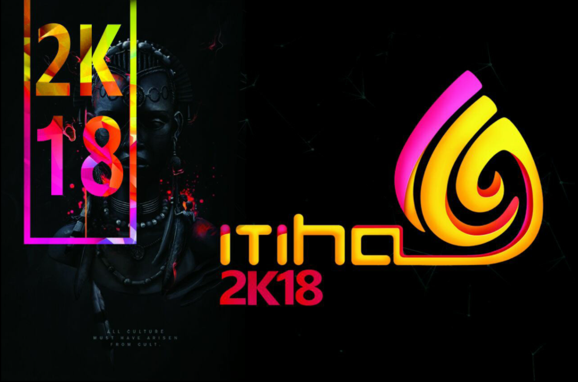
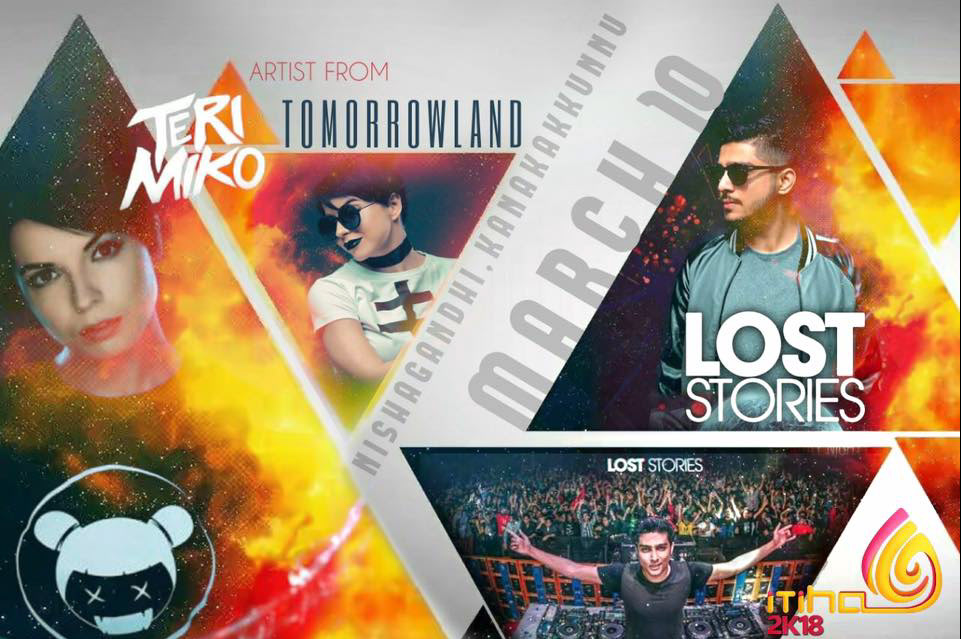
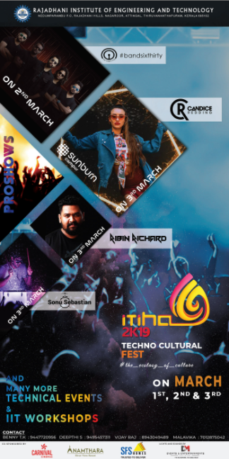
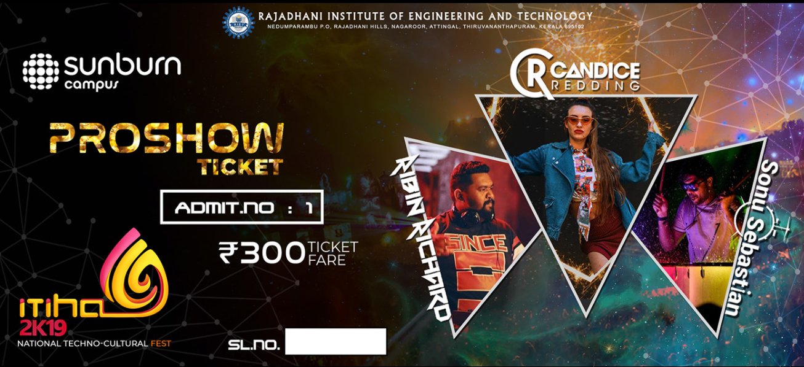
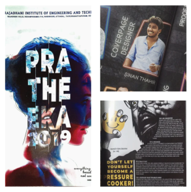
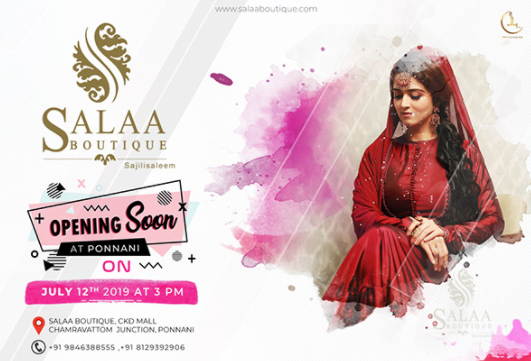

## Branding And Promotional
Mostly these designs and promo activities are done as a part of *Community events*, *Collegiative Events* and *Startup marketing*.

---

#### Itiha 2K18
**Itiha 2K18**, National Techno-Cultural Fest of Rajadhani Institute of Engineering and Technology, Trivandrum hosted on *March 8th, 9th and 10th*, 2018. I was one among the **designers** and collaborator in the **media and promotional** club.



---

#### ITIHA 2K19
> #the_ecstacy_of_culture

It was a great opportunity to work for the second time in the designing and media committee of our fest. Had been one of the prior designer under the lead by [Rahul Raj SR](https://www.linkedin.com/in/rahulraj-s-r-07587a141/), Committee Head. Here are some of my best piece of work. 

---

#### Pratheeka 2019 - The annual college magazine.
It was a great opportunity to create the face of Pratheeka 2019 - The annual college magazine. Representing as a cover designer as well as a core designer with the blessings as a team of 15, we were able to publish the hardcopies within the summerfall of 2019.

---

#### Salaa Boutique
> Logo Retouch and Flyer Design For [Salaa Boutique](https://www.instagram.com/salaaboutique/)

---

###### You can check out more of the design concepts and models [@behance/sinanthahir](https://www.behance.net/sinanthahir)