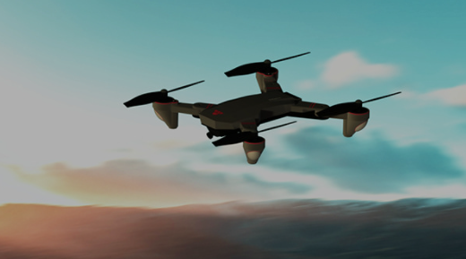
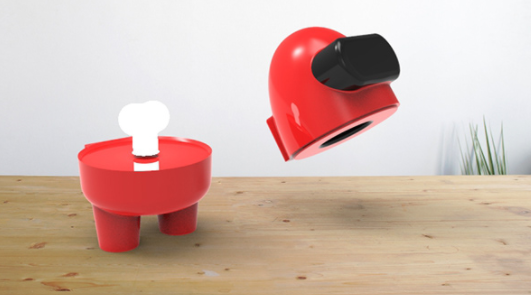
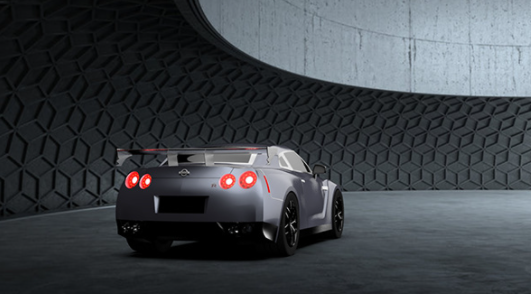
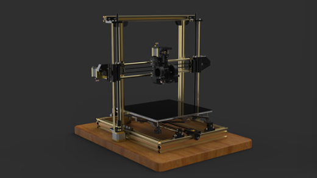

## Industrial Product Design

Mostly these are free time activity, turn out to be a full fledge concepts.

---

#### Drone Design : SiniGator-X
**Sinigator-X** is a Quadcopter Design submitted for the TechFest 2018 conducted by IIT Bombay. Design was made up with the rotor base at 135 Deg Axis-Planned, X factored and was complimented for the best endurance factor and seamless flight dynamics by the Jury.

To check out the full design, 👉 [Click Here](https://www.behance.net/gallery/106681963/Drone-Design-SINIGATOR-X)

---

#### Among Us - Table Decor Light Lamp
>For those who are playing Among Us !

Lets widen your table space with Among Us - Table Light, which has as far as lumen 400 light source. The Concept design was modelled using Dassault's Solidworks and Rendered Using Keyshot 9 Pro.

To check out the full design, 👉 [Click Here](https://www.behance.net/gallery/106966015/Among-Us-Table-Lamp)

---

### Nissan GTR Mockups
> Model Designing & Realistic Rendering

To check out the full design, 👉 [Click Here](https://www.behance.net/gallery/125810393/Nissan-GTR-Mockup-Design-and-Renders)

---

### 3D Cartesian Printer 
> Model Designing & Product Rendering

To check out the full design, 👉 [Click Here](https://www.behance.net/gallery/126872525/3D-Printer-Modelling-and-Renders)
