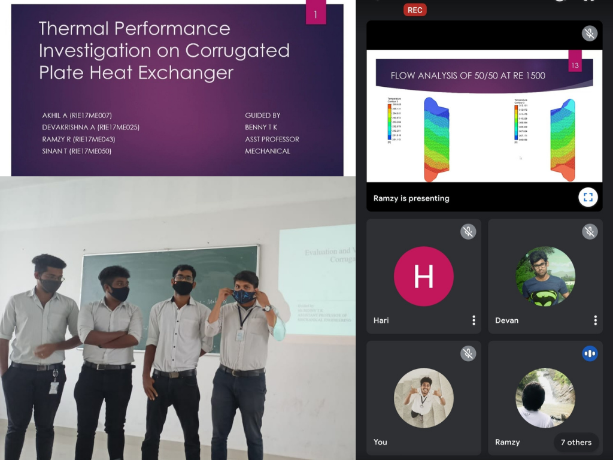
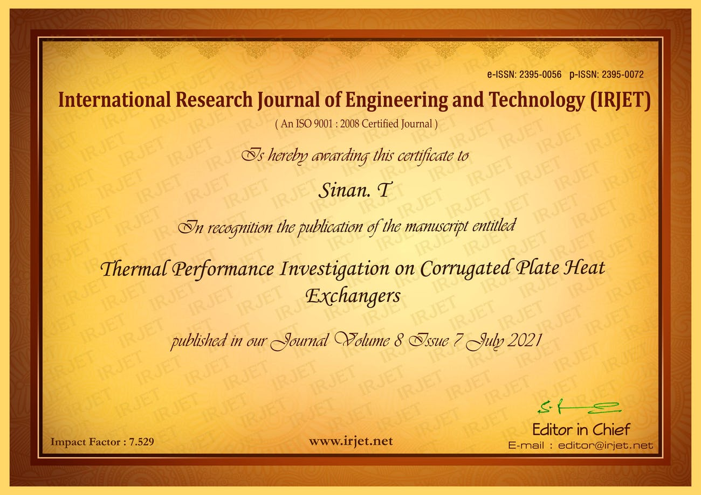

## Thermal Performance Investigation of a Corrugated Plate Heat Exchanger (TICPHE)


Guided by Benny T.K, Asst. Professor, Rajadhani Institute of Engineering and Technology, Attingal


#### Objective
Compact heat exchangers have become an essential necessity for power production and multi other purposes on a daily basis. The corrugated plate exchangers (CPHE) are well known for their high thermal performance. This study compares two CPHE with angle 70/70 (deg) and 50/50 (deg) with basic CPHE with angle 60/60. 

> *It was our first time, engage in such a complex design and simulation featured model or to say for an research orientation. Each and every day, we will go for a new design from scratch and simulate in varying conditions; and above all that the numerical model expressions. Every night we will be on g-meet, discussing reference journals, user manuals to binge cringes. It was hard but fun.*

> Amidst on the pandemic, [Ramzy Rahim](https://www.linkedin.com/in/ACoAACx9sgMB98uNwtVk8mrCuD-Y8IXt1r9wQhw), [Akhil A](https://www.linkedin.com/in/ACoAADNR2FIBk32M2amvkrA5r1EDX_flxYUSnIA), [Devakrishna A](https://www.linkedin.com/in/ACoAADNovH0BKJvV_fGAoJ8zCihIA7PU10jQK2Y) and I under the guidance of Asst. [Prof Benny TK](https://www.linkedin.com/in/benny-k-a1794730) was researching on the thermal performance character inside the CPHE for turbulent flow conditions as for our Final year Bachelors Degree Project. The work was assessed in the presence of Dr.Bindu S, HOD, Asst. professor, Mr. [Harishanker U.S](https://www.linkedin.com/in/harisankarme), Asst. Professor, Project coordinator and other faculties of our department. 

#### Methodology
The different CPHE models are designed using `Solidworks 2020`, Flow and Thermal Analysis was done through `Ansys Workbench (Fluent)`, Analytical Calculation are carried out on `MS Excel`, Infographics are made up on `Mathlab` and  Work scheduling are done using `Notion`. 

#### Results
The overall tests have been conducted on CPHEs for two symmetric chevron angles (β) of 50/50 and 70/70. Data are obtained for steady state, single phase (water-water), counter arrangements, and for Reynolds number (Re) ranges from 500 to 2500, sophisticated mesh technique have been adopted to develop the mesh for the plates and the fluid between the plates. An appropriate grid refinement test has been carried out for the accuracy of the numerical results. The result have been validated with benchmark experimental and numerical data. A realizable k – ε turbulence model with scalable wall treatment found to provide the most consistent and accurate prediction of the thermal performance of CPHE. The numerical result showed that the effectiveness of the CPHE 50/50 is higher than 60/60 but the CPHE 70/70 shows less effectiveness than other.

#### Publication

The result came to a much dependable solution on each variance of flow parameters and are explained in the *Journal(Paper)* Published on **[IRJET Journal Volume: 8 Issue: 7](https://www.irjet.net/archives/V8/i7/IRJET-V8I7245.pdf)**.